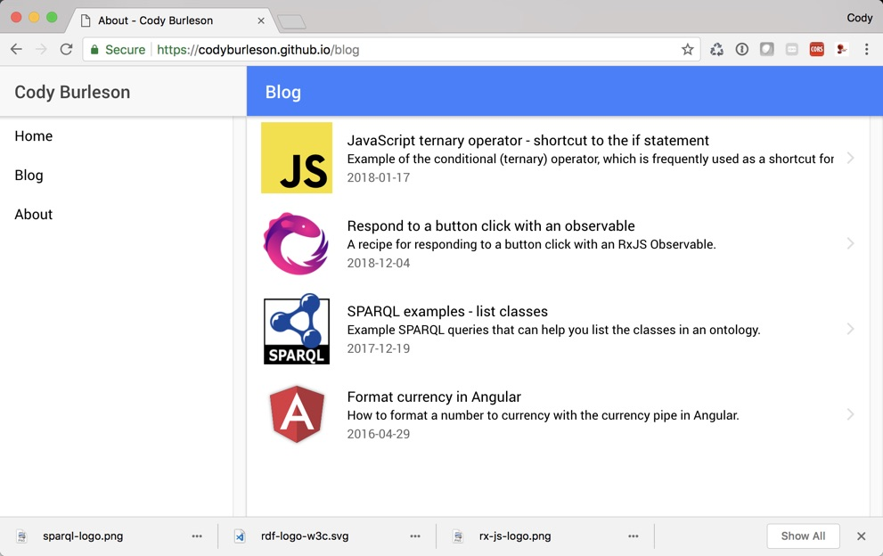

# cburleson-pwa

This project is my experimental lab project for learning about Progressive Web Apps (PWAs), Angular 6, 
Ionic 4, and potentially also Capacitor.

A big shout goes out to Adrián Brito Pacheco, whose [angular-ionic-master-detail](https://github.com/abritopach/angular-ionic-master-detail) project was a big help in guiding me this far.

Right now, the goal of this project is to make a blog that renders content from flat markdown files.

The generated result from this project can currently be viewed at:

**https://codyburleson.github.io/**

This project was generated with [Angular CLI](https://github.com/angular/angular-cli) version 6.0.0.

If you're interested in how I built this app from the very beginning, see docs/how-i-built-this-app.md.

## Developer prerequisites

- Globally install the Angular CLI: `npm install -g @angular/cli`

## Usage

Tasks                    | Description
-------------------------|---------------------------------------------------------------------------------------------------------------
npm i                    | Install everything needed
ng serve                 | Start the app in development mode without launching browser; navigate to `http://localhost:4200/`
npm start                | Start the app in development mode and launch browser.
npm run test             | Run unit tests with karma and jasmine
npm run e2e              | Run end to end tests
npm run build            | Build the app for production
npm run lint             | Run the linter (tslint)

## Further help

To get more help on the Angular CLI use `ng help` or go check out the [Angular CLI README](https://github.com/angular/angular-cli/blob/master/README.md).
