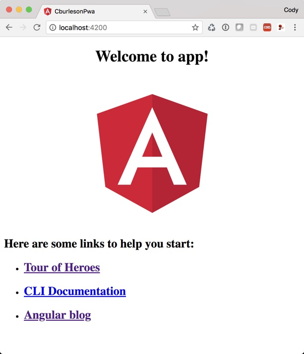
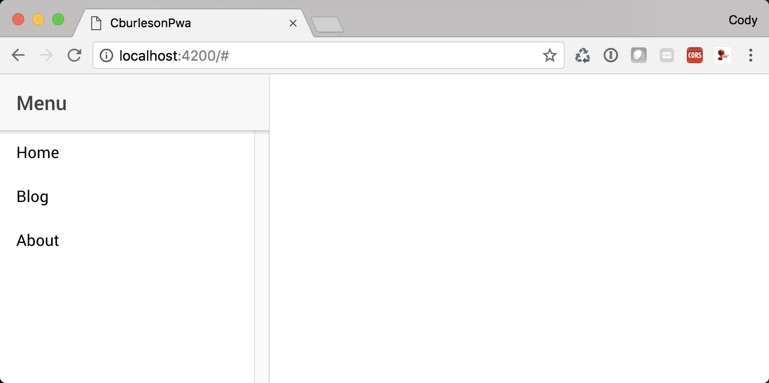
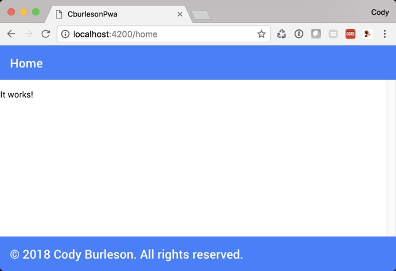
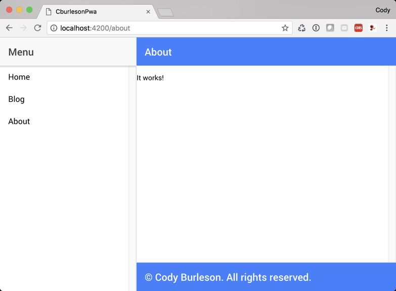
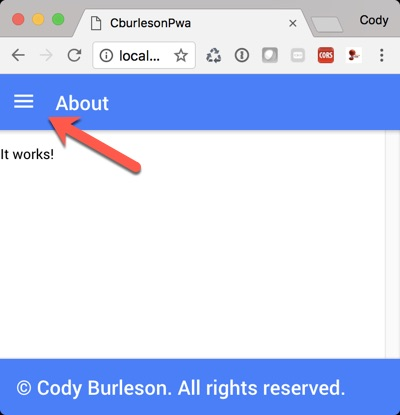
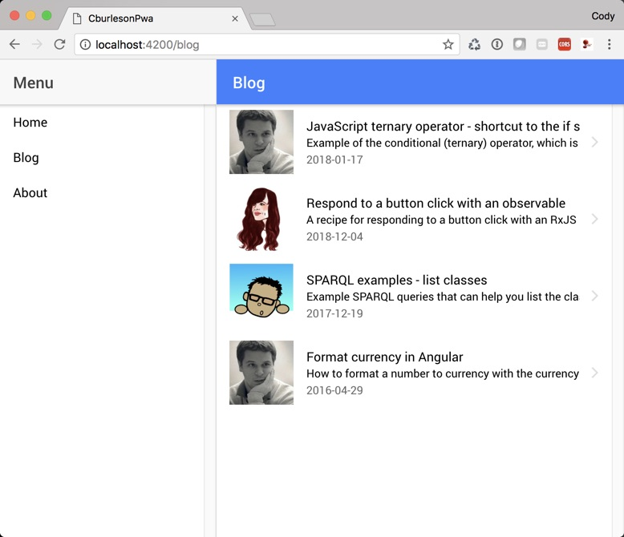

# How I built this app

I used the following repo as an initial guide for ideas. 
Shout out to the maker, Adrián Brito Pacheco for sharing with the world.

https://github.com/abritopach/angular-ionic-master-detail

## g servePrerequisites:

Both the Angular CLI and generated project have dependencies that require Node 6.9.0 or higher, together with NPM 3 or higher.

## Install the Angular cli

Install the Angular CLI globally with the following command.

`npm install -g @angular/cli`

## Generate and serve an Angular project via a development server

```
ng new cburleson-pwa
cd cburleson-pwa
ng serve
```



The Angular CLI already establishes this new project as a Git repository, so you do not also need to run `git init`. The CLI also performs an initial commit, so you've got a clean baseline to roll back to if needed.

Verify that you have the latest version of Angular in your `package.json` file. With my version of the CLI, everything generated for 6.0.0, yet there was already available 6.0.1, so I changed all of the angular packages to 6.0.1 as show below. I also updated the version number on several other dependencies, which I knew to have newer versions. Here's a look at my dependencies after these changes.

**package.json**

```  
  "dependencies": {
    "@angular/animations": "^6.0.1",
    "@angular/common": "^6.0.1",
    "@angular/compiler": "^6.0.1",
    "@angular/core": "^6.0.1",
    "@angular/forms": "^6.0.1",
    "@angular/http": "^6.0.1",
    "@angular/platform-browser": "^6.0.1",
    "@angular/platform-browser-dynamic": "^6.0.1",
    "@angular/router": "^6.0.1",
    "core-js": "^2.5.4",
    "rxjs": "^6.0.0",
    "zone.js": "^0.8.26"
  },
  "devDependencies": {
    "@angular/compiler-cli": "^6.0.1",
    "@angular-devkit/build-angular": "~0.6.1",
    "typescript": "~2.7.2",
    "@angular/cli": "~6.0.1",
    "@angular/language-service": "^6.0.1",
    "@types/jasmine": "~2.8.7",
    "@types/jasminewd2": "~2.0.3",
    "@types/node": "~8.9.4",
    "codelyzer": "~4.3.0",
    "jasmine-core": "~3.1.0",
    "jasmine-spec-reporter": "~4.2.1",
    "karma": "~1.7.1",
    "karma-chrome-launcher": "~2.2.0",
    "karma-coverage-istanbul-reporter": "~1.4.2",
    "karma-jasmine": "~1.1.2",
    "karma-jasmine-html-reporter": "^1.1.0",
    "protractor": "~5.3.2",
    "ts-node": "~6.0.3",
    "tslint": "~5.10.0"
  }
```

If you want to be sure of a clean install of dependencies, you can delete the `node_modules/` directory at any time and the run `npm install` or `npm i` for short. Generally, however, all you need to do is run `npm i` again after making changes to `package.json`.

It's a good practice to run and spot-check your app any time you make dependency changes. You can do that with the following command:

`ng serve --open`

For me, everything checked out, so I did a commit against this new stable check-point:

**Commit** - Upgrade package dependencies

## Keep a dev log

One thing I like to do with new projects is keep notes and maintain a list of references. I do this using markdown files to create something like a little mini-wiki inside the project. It's helpful to myself and could potentially be helpful to other developers in the future. This step is optional, of course, but I highly recommend the practice.

In the project root, create a `docs/` directory. You can create subdirectories if desired (e.g. `devlog/`). This is where you can keep notes, references, and further documentation than what you'd normally include in the project's `README.md` file.

With that out of the way, let's get to building!


## Install ionic dependencies

`npm i @ionic/angular @ionic/cli-hooks @ionic/schematics-angular --save`

Install ionic tslint rules with the following command:

`npm i tslint-ionic-rules --save-dev`

Extend the rules from your `tslint.json` file.

Add this just above your rules section in `tslint.json`:

`"extends": "tslint-ionic-rules"`

For example:

```
 "extends": "tslint-ionic-rules",
  "rules": {
```

## Modify angular.json file

Next, we need to make a couple of changes to the `angular.json` file.

For one thing, just as a preferred convention, I'd like all the build output for production to go 
directly into a `www/` directory instead of a `dist/` directory.

In `angular.json`, change from this:

`"outputPath": "dist/cburleson-pwa",`

to this:

`"outputPath": "www",`

We also want to copy everything in the assets folder during the build and not just a couple of specific files.
Additionally, we need to copy the ionic assets from the `node_modules/` directory into the project.

Change the `assets` stanza from this:

```
"assets": [
  "src/favicon.ico",
  "src/assets"
],
```

to this:

```
"assets": [
  {
    "glob": "**/*",
    "input": "src/assets",
    "output": "assets"
  },
  {
    "glob": "**/*",
    "input": "node_modules/@ionic/angular/dist/ionic",
    "output": "./ionic"
  }
],
```

## Setup an Ionic split pane menu layout

At this point, we should be able to get some ionic components rendering in the web browser. Let's give it a try.

Replace everything in `src/app/app.component.html` with the following:

```
<ion-app>
  <ion-split-pane>
    <ion-menu>
      <ion-header>
        <ion-toolbar>
          <ion-title>Menu</ion-title>
        </ion-toolbar>
      </ion-header>
      <ion-content>
        <ion-list>
          <ion-menu-toggle autoHide="false">
            <ion-item href="#">Home</ion-item>
          </ion-menu-toggle>
          <ion-menu-toggle autoHide="false">
            <ion-item href="#">Blog</ion-item>
          </ion-menu-toggle>
          <ion-menu-toggle autoHide="false">
            <ion-item href="#">About</ion-item>
          </ion-menu-toggle>
        </ion-list>
      </ion-content>
    </ion-menu>
    <ion-nav main></ion-nav>
  </ion-split-pane>
</ion-app>

```

Next, edit `src/app.module.ts` and import the `IonicModule` as shown below.

```
import { BrowserModule } from '@angular/platform-browser';
import { NgModule } from '@angular/core';

import { AppComponent } from './app.component';

import { IonicModule } from '@ionic/angular';

@NgModule({
  declarations: [
    AppComponent
  ],
  imports: [
    BrowserModule,
    IonicModule.forRoot()
  ],
  providers: [],
  bootstrap: [AppComponent]
})
export class AppModule { }
```

You should now be able to serve the app with the following command.

`ng serve --open`

You should see the following result. Note that the `ion-split-pane` will be hidden if your browser window size it too 
small, so if you don't see it, just expand the size of your browser window.



That's a little preview of where we're going with this, but let's back up for a bit before we really start working 
with the split pane.

In `src/app.component.html`, comment out the whole split-pane stanza and put the following instead.

```
<ion-app>
  <ion-router-outlet main></ion-router-outlet>
</ion-app>
```
Your `src/app.component.html` file should now look like this:

```
<!--
<ion-app>
  <ion-split-pane>
    <ion-menu>
      <ion-header>
        <ion-toolbar>
          <ion-title>Menu</ion-title>
        </ion-toolbar>
      </ion-header>
      <ion-content>
        <ion-list>
          <ion-menu-toggle autoHide="false">
            <ion-item href="#">Home</ion-item>
          </ion-menu-toggle>
          <ion-menu-toggle autoHide="false">
            <ion-item href="#">Blog</ion-item>
          </ion-menu-toggle>
          <ion-menu-toggle autoHide="false">
            <ion-item href="#">About</ion-item>
          </ion-menu-toggle>
        </ion-list>
      </ion-content>
    </ion-menu>
    <ion-nav main></ion-nav>
  </ion-split-pane>
</ion-app>
-->

<ion-app>
  <ion-router-outlet main></ion-router-outlet>
</ion-app>

```

Nothing will render in your browser now and you'll have an error like this in your JavaScript console:

```
ERROR Error: StaticInjectorError(AppModule)[IonRouterOutlet -> ChildrenOutletContexts]: 

```

We'll fix that up right quick.

## Create a routing module for the app

In the sr/app/ directory, create a file named `app-routing.module.ts` with the following contents:

```
import { NgModule } from '@angular/core';
import { RouterModule, Routes } from '@angular/router';

const routes: Routes = [
  { path: '', redirectTo: '/home', pathMatch: 'full' },
  { path: 'home', loadChildren: './pages/home/home.module#HomeModule' },
];

@NgModule({
  imports: [RouterModule.forRoot(routes)],
  exports: [RouterModule]
})
export class AppRoutingModule {}
```

TO DO: CHANGE ABOVE TO HAVE ACTUAL USED PATH TO HOME


In `src/app.component.ts`, we now need to import the `AppRoutingModule` and add it to the imports section of the @NgModule as shown:

```
import { BrowserModule } from '@angular/platform-browser';
import { NgModule } from '@angular/core';
import { AppComponent } from './app.component';
import { IonicModule } from '@ionic/angular';

import {AppRoutingModule} from './app-routing.module';

@NgModule({
  declarations: [
    AppComponent
  ],
  imports: [
    AppRoutingModule,
    BrowserModule,
    IonicModule.forRoot()
  ],
  providers: [],
  bootstrap: [AppComponent]
})
export class AppModule { }

```

In the JavaScript console, our error changes. Now it says this:

```
ERROR Error: Uncaught (in promise): Error: Cannot find module "./pages/home/home.module".
```

We'll use the `ng generate` command to stub out a new component for our home page. A path is given so that the 
component is generated within a pages sub-directory.

`ng generate component /pages/home`

So, now we should have the following files:

- src/
  - app/
    - pages/
      - home/
        - home.component.css
        - home.component.html
        - home.component.spec.ts
        - home.component.ts


Edit `home.component.ts` to be as follows. We'll use the year field for rendering a copyright statement.

```
import { Component, OnInit } from '@angular/core';

@Component({
  selector: 'app-home',
  templateUrl: './home.component.html',
  styleUrls: ['./home.component.css']
})
export class HomeComponent implements OnInit {

  currentYear: number;

  constructor() { }

  ngOnInit() {
    this.currentYear = new Date().getFullYear();
  }

}
```

Edit `home.component.html` to be this:

```
<ion-header no-border>
  <ion-toolbar color='primary'>
    <ion-title>Home</ion-title>
  </ion-toolbar>
</ion-header>

<ion-content no-bounce>
  <p>It works!</p>
</ion-content>

<ion-footer>
  <ion-toolbar color="primary">
    <ion-title>© {{ currentYear }} Cody Burleson. All rights reserved.</ion-title>
    <!--
    <ion-buttons slot="end">
      <div class="github-button"><iframe allowtransparency="true" scrolling="no" frameborder="0" src="https://buttons.github.io/buttons.html#href=https%3A%2F%2Fgithub.com%2Fabritopach%2Fangular-ionic-master-detail&amp;title=&amp;aria-label=Star%20abritopach%2Fangular-ionic-master-detail%20on%20GitHub&amp;data-icon=octicon-star&amp;data-text=Star" style="width: 50px; height: 20px; border: none;"></iframe></div>
      <div class="github-button"><iframe allowtransparency="true" scrolling="no" frameborder="0" src="https://buttons.github.io/buttons.html#href=https%3A%2F%2Fgithub.com%2Fabritopach&amp;title=&amp;aria-label=Follow%20%40abritopach%20on%20GitHub&amp;data-text=GitHub" style="width: 67px; height: 20px; border: none;"></iframe></div>
    </ion-buttons>
    -->
  </ion-toolbar>
</ion-footer>
```

Create a new file in `src/pages/home` called `home-routing.module.ts` with the following contents:

```
import { NgModule } from '@angular/core';
import { RouterModule, Routes } from '@angular/router';

import { HomeComponent } from './home.component';

const routes: Routes = [
  {
    path: '',
    component: HomeComponent
  }
];

@NgModule({
  imports: [RouterModule.forChild(routes)],
  exports: [RouterModule]
})
export class HomeComponentRoutingModule { }

```

Create a new file in `src/pages/home` called `home.module.ts` with the following contents:

```
import { NgModule } from '@angular/core';
import { CommonModule } from '@angular/common';
import { IonicModule } from '@ionic/angular';

import { HomeComponent } from './home.component';
import { HomeComponentRoutingModule } from './home-routing.module';

@NgModule({
  imports: [
    CommonModule,
    IonicModule,
    HomeComponentRoutingModule
  ],
  declarations: [HomeComponent],
  entryComponents: [HomeComponent]
})
export class HomeModule {}
```

Now take the HomeComponent references out of src/app.module.ts if any are there. They would likely have been added 
when we created the component using ng generate. It is very important that you remove them or there will be 
errors.

At this point, the Home page should render in the browser as shown:



It's a good time to commit the code on this stable checkpoint.

**Commit** - Add router and Home page

## Add About page

Now let's see if you can repeat the exact same process we just created for the Home page to create an About page.
Starting with the ng generate command, we'll repeat the process.

This time, we'll use the shortcut `g` for generate and `c` for component.

- `ng g c /pages/about`

Remember, you must remove all references to the AboutComponent from `app.module.ts` after the CLI 
generates the component for the page.


Create `about-routing.module.ts`

```
import { NgModule } from '@angular/core';
import { RouterModule, Routes } from '@angular/router';

import { AboutComponent } from './about.component';

const routes: Routes = [
  {
    path: '',
    component: AboutComponent
  }
];

@NgModule({
  imports: [RouterModule.forChild(routes)],
  exports: [RouterModule]
})
export class AboutComponentRoutingModule { }
```


Create `about.module.ts`

```
import { NgModule } from '@angular/core';
import { CommonModule } from '@angular/common';
import { IonicModule } from '@ionic/angular';

import { AboutComponent } from './about.component';
import { AboutComponentRoutingModule } from './about-routing.module';

@NgModule({
  imports: [
    CommonModule,
    IonicModule,
    AboutComponentRoutingModule
  ],
  declarations: [AboutComponent],
  entryComponents: [AboutComponent]
})
export class AboutModule {}
```

Edit the about.component.html...

```
<ion-header no-border>
  <ion-toolbar color='primary'>
    <ion-title>About</ion-title>
  </ion-toolbar>
</ion-header>

<ion-content no-bounce>
  <p>It works!</p>
</ion-content>

<ion-footer>
  <ion-toolbar color="primary">
    <ion-title>© {{ currentYear }} Cody Burleson. All rights reserved.</ion-title>
    <!--
    <ion-buttons slot="end">
      <div class="github-button"><iframe allowtransparency="true" scrolling="no" frameborder="0" src="https://buttons.github.io/buttons.html#href=https%3A%2F%2Fgithub.com%2Fabritopach%2Fangular-ionic-master-detail&amp;title=&amp;aria-label=Star%20abritopach%2Fangular-ionic-master-detail%20on%20GitHub&amp;data-icon=octicon-star&amp;data-text=Star" style="width: 50px; height: 20px; border: none;"></iframe></div>
      <div class="github-button"><iframe allowtransparency="true" scrolling="no" frameborder="0" src="https://buttons.github.io/buttons.html#href=https%3A%2F%2Fgithub.com%2Fabritopach&amp;title=&amp;aria-label=Follow%20%40abritopach%20on%20GitHub&amp;data-text=GitHub" style="width: 67px; height: 20px; border: none;"></iframe></div>
    </ion-buttons>
    -->
  </ion-toolbar>
</ion-footer>
```


In src/app/app-routing.module.ts, add the following route:

`{ path: 'about', loadChildren: './pages/about/about.module#AboutModule' }`

Now you can test that the routing is working.

When you enter the following URLs in your browser, you should navigate to 
the respective pages:

- http://localhost:4200/home
- http://localhost:4200/about

Again, it's a good time to commit this stable checkpoint.

**Commit** - Add About page stub

## Bring back the split pane

Now we can bring back that cool split pane we added earlier.

Change src/app/app.component.html to the following:

```
<ion-app>
  <ion-split-pane>
    <ion-menu>
      <ion-header>
        <ion-toolbar>
          <ion-title>Menu</ion-title>
        </ion-toolbar>
      </ion-header>
      <ion-content>
        <ion-list>
          <ion-menu-toggle autoHide="false">
            <ion-item href="/home">Home</ion-item>
          </ion-menu-toggle>
          <ion-menu-toggle autoHide="false">
            <ion-item href="#">Blog</ion-item>
          </ion-menu-toggle>
          <ion-menu-toggle autoHide="false">
            <ion-item href="/about">About</ion-item>
          </ion-menu-toggle>
        </ion-list>
      </ion-content>
    </ion-menu>
    <ion-nav main><ion-router-outlet main></ion-router-outlet></ion-nav>
  </ion-split-pane>
</ion-app>
```

Notice that I moved the `ion-router-outlet` element into the `ion-nav` element.
I also added our routes for Home and About to the href attribute of each respective `ion-item`.

Now, we can render the site and click between home and about!



Commit the stable checkpoint.

**Commit** - Add ion-split-pane menu

## Add a menu toggle button

Now, for the mobile standard, we want a menu button in the header to 
show up when the menu is not visible. Clicking it should expand the 
menu into view. With ionic, this is simple.

In src/home/home.component.html, replace the current ion-header 
element with this.

```
<!-- <ion-header no-border> -->
<ion-header>
  <ion-toolbar color="primary">
    <ion-buttons slot="start">
      <ion-menu-button></ion-menu-button>
    </ion-buttons>
    <ion-title>Home</ion-title>
  </ion-toolbar>
</ion-header>
```

I left a comment in place to remind us that we can have it rendered 
with or without a shadow border.

Do the same now for the About page.

You should see the ion-menu-button in the header. Nothing else needs to be done for the interactive behavior.
Click it and the menu will slide into view!



**Commit** - Add ion-menu-button to header

## Create the Blog Page

Next, we're going to create the Blog page, upon which we'll render a list of 
blog post items that we'll get from a service.

At this point, you should be able to create the Blog landing page your self and hook up 
the routing by following the same procedure we used for Home and About.

Give it a go and then come back here when you get it working.

Got it working? Great! So, commit the stable checkpoint.

**Commit** - Add Blog main page


## Add the blog service

Execute the command to stub out the `BlogService`:

`ng g service services/blog`

Now, edite the generated `src/app/services/blog.service.ts` to be as follows:

```
import { Injectable } from '@angular/core';

export interface Item {
  title: string;
  slug: string;
  description: string;
  date: string;
  format?: string;
  image: string;
}

@Injectable({
  providedIn: 'root'
})
export class BlogService {

  public items: Item[] = [];

  constructor() {
    this.items = [
      {
        title: 'JavaScript ternary operator - shortcut to the if statement',
        slug: 'javascript-ternary-operator',
        description: 'Example of the conditional (ternary) operator, which is frequently used as a shortcut for the if statement.',
        date: '2018-01-17',
        format: 'text/markdown',
        image: 'https://avatars.io/twitter/juan'
      },
      {
        title: 'Respond to a button click with an observable',
        slug: 'respond-to-a-button-click-with-an-observable',
        description: 'A recipe for responding to a button click with an RxJS Observable.',
        date: '2018-12-04',
        format: 'text/markdown',
        image: 'https://avatars.io/twitter/laura'
      },
      {
        title: 'SPARQL examples - list classes',
        slug: 'sparql-examples-list-classes',
        description: 'Example SPARQL queries that can help you list the classes in an ontology.',
        date: '2017-12-19',
        format: 'text/markdown',
        image: 'https://avatars.io/twitter/luis'
      },
      {
        title: 'Format currency in Angular',
        slug: 'format-currency-in-angular',
        description: 'How to format a number to currency with the currency pipe in Angular.',
        date: '2016-04-29',
        format: 'text/markdown',
        image: 'https://avatars.io/twitter/juan'
      }
    ];
  }

  getItemBySlug(slug): Item {
    return this.items.find(item => item.slug === slug);
  }

}

```

We're going to just work with four example content items for now.

Next, we need to inject the service into the component that will use it.

Edit `src/app/pages/blog/blog.component.ts` to be as follows. We import the BlogService and inject it 
into the constructor...

```
import { Component, OnInit } from '@angular/core';
import {BlogService} from '../../services/blog.service';

@Component({
  selector: 'app-blog',
  templateUrl: './blog.component.html',
  styleUrls: ['./blog.component.css']
})
export class BlogComponent implements OnInit {

  constructor(public blogService: BlogService ) { }

  ngOnInit() {
  }

}

```

Also, we need to add the BlogService in the providers section of the @NgModule `app.module.ts` as shown:

```
import { BrowserModule } from '@angular/platform-browser';
import { NgModule } from '@angular/core';
import { AppComponent } from './app.component';
import { IonicModule } from '@ionic/angular';

import {AppRoutingModule} from './app-routing.module';
import {BlogService} from './services/blog.service';

@NgModule({
  declarations: [
    AppComponent,
  ],
  imports: [
    AppRoutingModule,
    BrowserModule,
    IonicModule.forRoot()
  ],
  providers: [BlogService],
  bootstrap: [AppComponent]
})
export class AppModule { }
```

Finally, we need to edit the HTML to render the list of blog posts.

Edit src/app/pages/blog.component.html to be as follows:

```
<!-- <ion-header no-border> -->
<ion-header>
  <ion-toolbar color="primary">
    <ion-buttons slot="start">
      <ion-menu-button></ion-menu-button>
    </ion-buttons>
    <ion-title>Blog</ion-title>
  </ion-toolbar>
</ion-header>

<ion-content no-bounce>
    <ion-list>
      <ion-item *ngFor="let item of blogService.items" detail="true" tappable routerLink="/blog/{{ item.slug }}">
        <ion-thumbnail slot="start">
          
        </ion-thumbnail>
        <ion-label>
          <h2>{{ item.title }}</h2>
          <h3>{{ item.description }}</h3>
          <p>{{ item.date }}</p>
        </ion-label>
      </ion-item>
    </ion-list>
</ion-content>

<!--
<ion-footer>
  <ion-toolbar color="primary">
    <ion-title>© {{ currentYear }} Cody Burleson. All rights reserved.</ion-title>
  </ion-toolbar>
</ion-footer>
-->
```



Looking good!

**Commit** - Add BlogService and render list on Blog landing page

## Create the blog detail page

Using the same procedure we used for creating Home and About, we can now create the Detail component. I won't call it BlogDetail 
because maybe, just maybe, the view will generically useful for more than just viewing the Blog details?

Anyway, we use the same procedure and we did to create Home and About. The difference this time is that we're going to 
do some stuff a little different with the routing.

For now, let's just create the component...

`ng g c /pages/detail`

Remember to remove the generated references to the `DetailComponent` from `app.module.ts`.

Edit the generated `detail.component.ts` with the following contents. For now, we just want to log some output to the 
console so that we can make sure we're passing a parameter in the routing system properly.

```
import { Component, OnInit } from '@angular/core';
import { ActivatedRoute } from '@angular/router';
import { BlogService, Item } from '../../services/blog.service';

@Component({
  selector: 'app-detail',
  templateUrl: './detail.component.html',
  styleUrls: ['./detail.component.css']
})
export class DetailComponent implements OnInit {

  item: Item;

  constructor(private route: ActivatedRoute, public blogService: BlogService) { }

  ngOnInit() {
  }

  ionViewWillEnter() {
    console.log('> DetailComponent > ionViewWillEnter()');
    // console.log('this.route.snapshot', this.route.snapshot);
    const itemId = this.route.snapshot.paramMap.get('slug');
    // console.log('itemId', itemId);
    // this.item = this.blogService.getItemBySlug(itemId);
  }

}
```

We need to create `detail.module.ts` with the following contents:

```
import { NgModule } from '@angular/core';
import { CommonModule } from '@angular/common';
import { IonicModule } from '@ionic/angular';

import { DetailComponent } from './detail.component';
import { DetailComponentRoutingModule } from './detail-routing.module';

@NgModule({
  imports: [
    CommonModule,
    IonicModule,
    DetailComponentRoutingModule
  ],
  declarations: [DetailComponent],
  entryComponents: [DetailComponent]
})
export class DetailModule {}
```

Then create `detail-routing.module.ts` with the following contents:

```
import { NgModule } from '@angular/core';
import { RouterModule, Routes } from '@angular/router';

import { DetailComponent } from './detail.component';

const routes: Routes = [
  {
    path: '',
    component: DetailComponent
  }
];

@NgModule({
  imports: [RouterModule.forChild(routes)],
  exports: [RouterModule]
})
export class DetailComponentRoutingModule { }
```

Next, we'll add a parameterized route to the `routes` array in `app-routing.module.ts`

```
{ path: 'blog/:slug', loadChildren: './pages/detail/detail.module#DetailModule' },
```

The whole `app-routing.module.ts` then looks like this:

```
import { NgModule } from '@angular/core';
import { RouterModule, Routes } from '@angular/router';

const routes: Routes = [
  { path: '', redirectTo: '/home', pathMatch: 'full' },
  { path: 'home', loadChildren: './pages/home/home.module#HomeModule' },
  { path: 'blog/:slug', loadChildren: './pages/detail/detail.module#DetailModule' },
  { path: 'blog', loadChildren: './pages/blog/blog.module#BlogModule' },
  { path: 'about', loadChildren: './pages/about/about.module#AboutModule' }
];

@NgModule({
  imports: [RouterModule.forRoot(routes)],
  exports: [RouterModule]
})
export class AppRoutingModule {}

```

We're going to soon need the Angulat HTTPClientModule, so add that to `app.module.ts` as shown below (import it
and also put it in the `imports` array...

```
import { BrowserModule } from '@angular/platform-browser';
import { NgModule } from '@angular/core';
import { AppComponent } from './app.component';
import { IonicModule } from '@ionic/angular';

import {AppRoutingModule} from './app-routing.module';
import {BlogService} from './services/blog.service';
import {HttpClientModule} from '@angular/common/http';

@NgModule({
  declarations: [
    AppComponent,
  ],
  imports: [
    AppRoutingModule,
    BrowserModule,
    HttpClientModule,
    IonicModule.forRoot()
  ],
  providers: [BlogService],
  bootstrap: [AppComponent]
})
export class AppModule { }
```

**Commit** - Add Detail page component

At this point, we can manually enter one of the detail routes into the browser. For example:

http://localhost:4200/blog/respond-to-a-button-click-with-an-observable

And when we do this, we can see in the console output that the DetailComponent is being reached and 
that it is passing the slug as a route parameter...

```
Angular is running in the development mode. Call enableProdMode() to enable the production mode.
detail.component.ts:15 DetailComponent > contructor()
detail.component.ts:19 DetailComponent > ngOnInit()
detail.component.ts:23 > DetailComponent > ionViewWillEnter()
detail.component.ts:26 slug respond-to-a-button-click-with-an-observable
ion-router-outlet.js:227 ionRouterOutletActivated
```

But there's a problem. For some reason, the items in the list on the blog landing page 
are generating an anchor tag with href="#". This, in turn, is overriding the proper interaction 
where clicking an item in the list will navigate and pass the route. If you inspect the html you 
can see the following for an item:

``` html
<ion-item _ngcontent-c2="" detail="true" tappable="" tabindex="0" ng-reflect-detail="true" ng-reflect-router-link="/blog/javascript-ternary-opera" class="hydrated">
  <a href="#" class="item item-md item-detail-push hydrated activated">
    ...
  </a>
</ion-item>
```

This is fixed by changing the `routerLink` attribute in the `ion-item` to `href`.

From:

`<ion-item *ngFor="let item of blogService.items" detail="true" tappable routerLink="/blog/{{ item.slug }}">`

To:

`<ion-item *ngFor="let item of blogService.items" detail="true" tappable href="/blog/{{ item.slug }}">`

**Commit** - Fix router links in blog list
